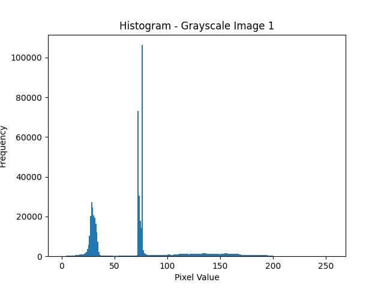
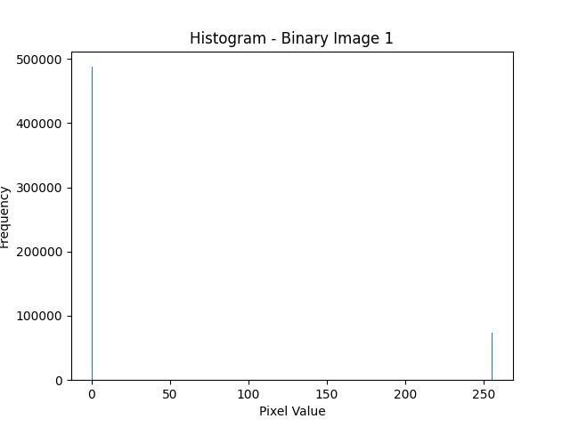
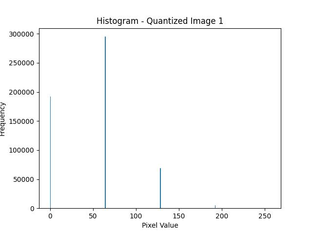
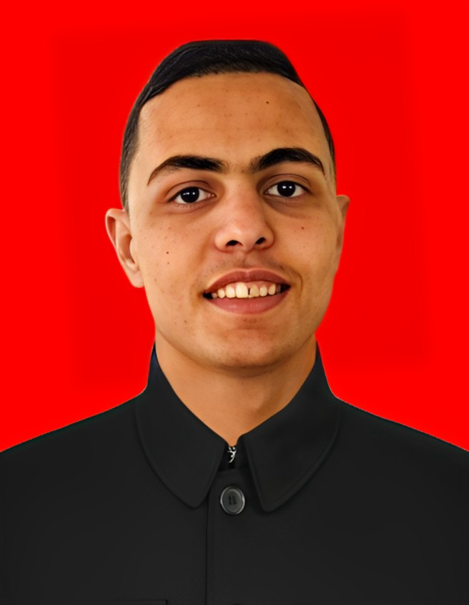
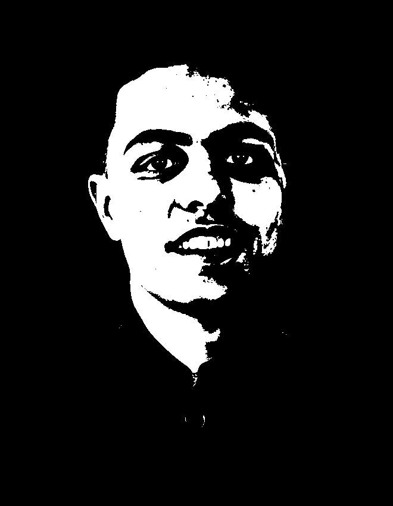
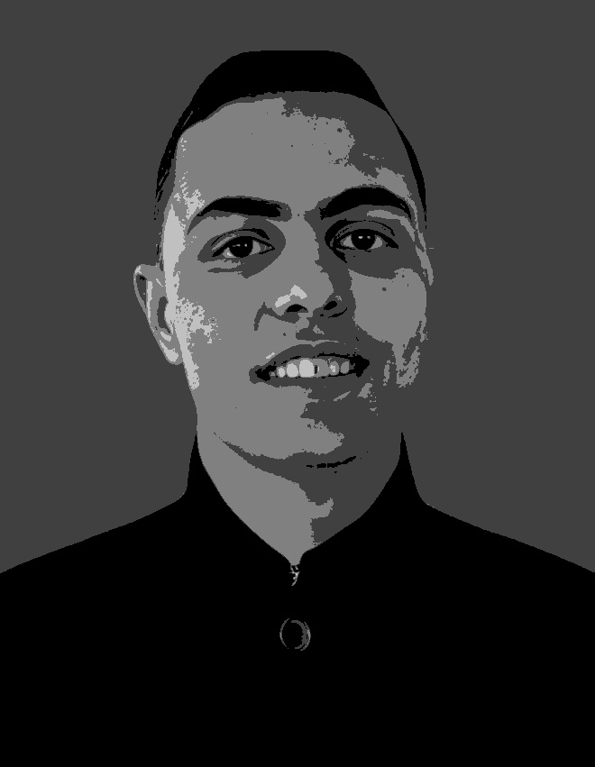

<h1 align="center">🎨 Digital Image Fundamentals - Assignment 1</h1>
<p align="center">
  <em>By Alaa Emad Al hout (120233046)</em><br>
  <strong>Complete walkthrough of essential image processing techniques and interpolation methods</strong>
</p>

---

## 📚 Project Overview

This assignment introduces key image processing operations using Python and OpenCV. It is structured in two main parts:

1. **Basic Image Processing** – Foundational operations such as reading, filtering, and histogram analysis.
2. **Image Interpolation** – Implementing and comparing Nearest Neighbor, Bilinear, and Bicubic interpolation methods.

This notebook is ideal for students and practitioners looking to build an understanding of pixel-level operations and resampling techniques.

---

## 📂 Directory Structure

```bash
.
├── input_images/           # Folder with original images
├── output_images/          # Folder containing results after processing
├── Assignment1.pdf         # Report of the assignment
├── Assignment_1_*.ipynb    # Jupyter Notebook (code + results)
├── Assignment_1_*.html     # HTML version of the notebook
└── link colab google.txt   # Google Colab launch link
```

---

## ⚙️ Technologies Used

- `Python 3`
- `OpenCV`
- `Matplotlib`
- `Jupyter Notebook`

> Optional: Can be enhanced into a `Streamlit` app or `Gradio` demo.

---

## 🧩 Part I: Basic Image Processing

This section explores basic transformations and visualizations of images using OpenCV:

| Task                           | Description                                                                 |
|--------------------------------|-----------------------------------------------------------------------------|
| 📥 Read Image                  | Load color image from file                                                 |
| 🌈 RGB to Grayscale            | Convert image to grayscale                                                 |
| 📊 Histogram Plotting          | Display RGB channel distributions                                          |
| 🌫 Gaussian & Median Filtering | Apply smoothing to reduce noise                                            |
| ✂️ Crop and Resize             | Manipulate image dimensions                                                |
| 💡 Brightness & Contrast       | Adjust intensity levels to enhance visuals                                 |

🧠 These are essential operations for any downstream computer vision task.

---

## 📈 Histogram Analysis (Image 1)

This section illustrates and explains pixel intensity distributions across three processed versions of `image1.jpg`.

| Grayscale Histogram                     | Binary Histogram                       | Quantized Histogram                       |
|----------------------------------------|----------------------------------------|-------------------------------------------|
|  |  |  |

### 🔍 Summary of Results

- **Grayscale Histogram:**  
  Shows a wide spread of intensity values, indicating a natural grayscale conversion where most pixel intensities fall between 0–150 with peaks due to background and facial features.

- **Binary Histogram:**  
  As expected from binary thresholding, only two spikes appear — one near 0 (black) and another at 255 (white), indicating the binary nature of the output.

- **Quantized Histogram:**  
  Displays discrete spikes corresponding to the limited set of gray levels introduced by quantization. This demonstrates how the image loses detail and compresses tonal variation while preserving some structure.

🧠 These histograms provide insight into how image processing transforms pixel intensity distributions, revealing differences in contrast, detail, and dynamic range.

---

## ✨ Part II: Image Interpolation

Interpolation estimates unknown pixel values when resizing or transforming images.

| Method            | Description                                                                 |
|------------------|-----------------------------------------------------------------------------|
| 🔲 Nearest        | Assigns value of the nearest pixel (fast but blocky)                        |
| 🟩 Bilinear       | Weighted average of four nearest pixels (smooth)                            |
| 🟦 Bicubic        | Uses 16 surrounding pixels (smoothest but more compute-intensive)           |

### ✅ Enhancements:
- Functions modularized for reuse
- Visual comparison of outputs
- Placeholder for quality metrics (e.g. PSNR, SSIM)

---

## 📊 Visualization Example

Using `image1.jpg` from the `input_images` folder, the following results were generated after applying various processing techniques.

| Original        | Grayscale        | Binary Threshold     | Quantized Image      |
|----------------|------------------|----------------------|----------------------|
|  |  |  |  |

| Nearest Neighbor Resized | Bilinear Resized           |
|--------------------------|----------------------------|
|  |  |

---

## 🚀 How to Run

You can launch the notebook easily via Google Colab:

🔗 **[Colab Link]** – see `link colab google.txt`

Or clone and run locally:

```bash
git clone https://github.com/yourname/DigitalImageFundamentals.git
cd DigitalImageFundamentals
jupyter notebook
```

---

## 📌 Key Takeaways

- Mastery of essential OpenCV functions
- Understanding and implementation of interpolation techniques
- Visualization and side-by-side comparisons
- Reproducible and modular code

---

## 🌱 Future Improvements

- [ ] Integrate image quality metrics (PSNR, SSIM)
- [ ] Add image upload widget for user input
- [ ] Export results in different formats
- [ ] Build interactive app with `Gradio` or `Streamlit`

---

## 🧾 License

This project is part of academic coursework. Attribution required if reused.

---

<p align="center">
  Created with ❤️ by <strong>Alaa Emad Al hout</strong> (120233046)
</p>
